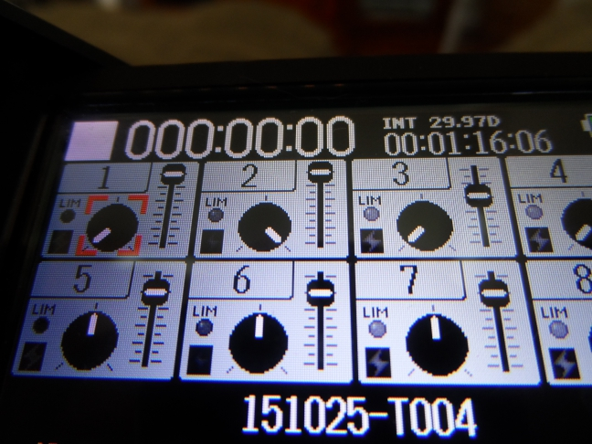

# Ambisonic Recording How-to

The [Core-Sound Tetramic](http://www.core-sound.com/TetraMic/1.php) delivers A-Format audio to a sound recorder with a minimum of four microphone inputs.  We are using a [Zoom F8](https://www.zoom-na.com/products/field-video-recording/field-recording/zoom-f8-multitrack-field-recorder) which can be powered by 8 AA batteries (make sure your batteries are fully charged before going out in the field).  It is necessary for the microphone inputs to have their gain set to the *exact same gain level*.  The Zoom F8 recorder simplifies this task because we can set one knob to control the gain of multiple inputs.  By default the F8 sould have Knob 1 control the gain for microphone inputs 1 through 4.  To verify this you can page through the main interface by twisting the encoder until you see a virtual mixer:

  Zoom F8 Multitrack Recorder

Turning Knob 1 should show gain changing on inputs 1 through 4.  If this is not the case it can be re-set to do so under Menu/Input/Trim Link.

Set your levels so there is clipping.  Hit Record to start recording and stop to stop recording.  Monitor your recording with the headphone output jack (you will probably need an 1/4" to 1/8" adapter for this).  What you are hearing is a mix of the channels turned up in the Zoom F8 virtual mixer.  It is not a proper ambisonic decoding, but will allow you to determine that your audio is clear and not distorted in any way.

The Zoom will produce four-channel WAV files containing your A-Format audio.  Core-Sound produces a [custom VST](https://www.vvaudio.com/products/VVTetraVST) to calibrate the A-format signal and convert it to B-Format.  This VST makes use of the custom callibration files produced by Core-Sound for every microphone they produce.  Make note of the serial number for the microphone and use the [corresponding calibration files](ambisonic-recording/callibrations).  The calibration files need to be [installed correctly](https://www.vvaudio.com/support) on your computer, along with the VVTetraVST plug-in.  

Now that you have B-Format audio from the VVTetraVST you can decode it in may different ways.  Enjoy!
